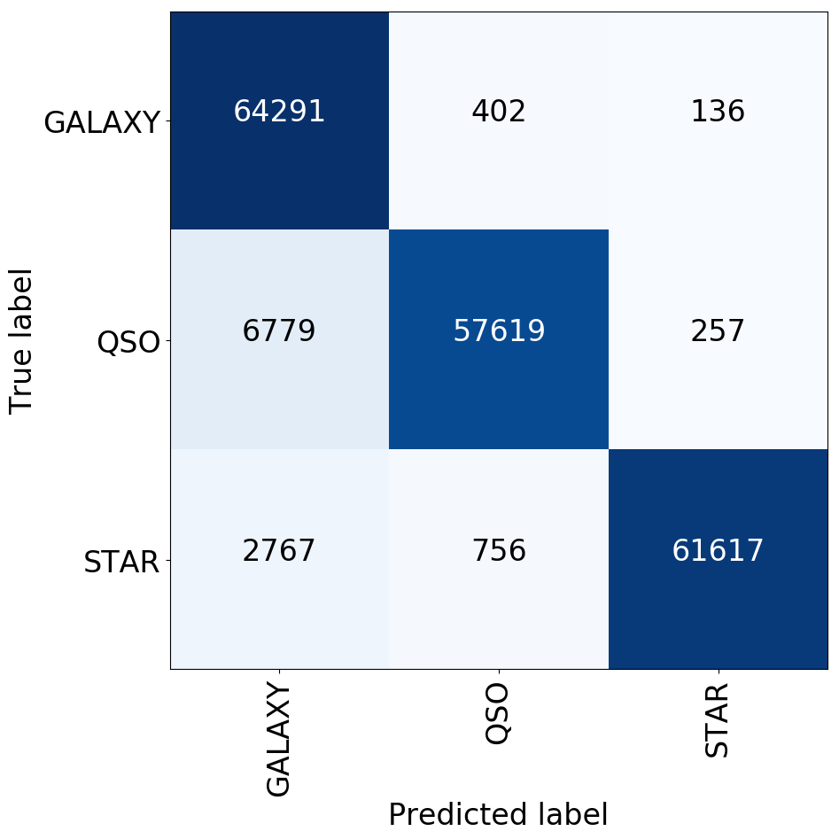

# AGN clustering / machine learning on catalogues

Code for the ASTRON-hackathon 2018 in Dwingelo (the Netherlands)

## Data sets
 * SDSS from sciserver
 * Z_FORGE data set: http://zfourge.tamu.edu/DR2016/data.html

## Autoencoder of SDSS data (2D encoder layer)

[code](AGN_autoencoder.py) , [code](Data_Reduce.py)

## Neural Network to classify the SDSS-data

[notebook](Neural%20Network%20SDSS.ipynb) , [data.p3](../../releases/download/data-file/data.p3)

We applied a 6-layer dense neural network, 14 features, 32 relu nodes, 48 relu nodes, 32 relu nodes, 16relu nodes, 8 relu nodes, 3 softmax nodes to classify.  This is the learning curve, which ends at approximately 96% accuracy and no suggestion of overfitting. Nevertheless, we’re clueless on how to create a more complicated model, except for adding more layers, which we didn’t do.

The performance is similar to a Random Forest, but the network has less bias towards classifying as Galaxies, shown by these confusion matrices.

Random forest left, neural network right

          
